# Sistema Bancario - Design Pattern

## Overview

Questo progetto rappresenta un sistema bancario completo e didattico che implementa **dodici design pattern fondamentali** della programmazione orientata agli oggetti. Il sistema simula operazioni bancarie reali mentre serve come catalogo vivente dei design pattern più importanti nell'ingegneria del software.

Il sistema è caratterizzato da una gestione avanzata degli errori, logging multi-livello, persistenza automatica dei dati, monitoraggio delle transazioni in tempo reale, e un sistema di output flessibile che può adattarsi a diverse modalità di visualizzazione.

## Architettura del Sistema

Il sistema è organizzato:

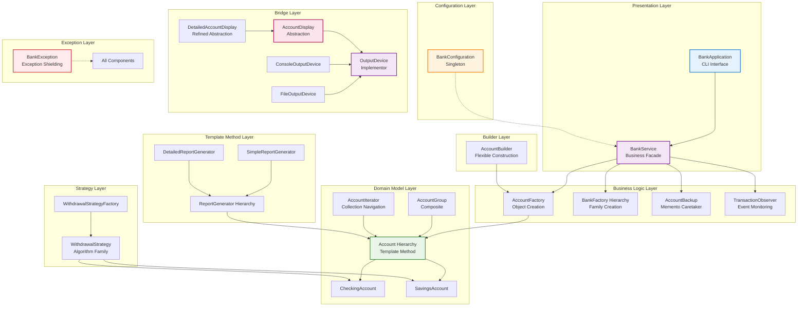

## Catalogo Completo dei Design Pattern

### Pattern Creazionali (Creational Patterns)

#### 1. Factory Pattern - Creazione Centralizzata

Il Factory Pattern fornisce un'interfaccia per creare oggetti senza specificare le loro classi concrete. Nel nostro sistema bancario, rappresenta la fondazione del sistema di creazione degli account.

**Implementazione:** `AccountFactory`

**Problema Risolto:** Come creare diversi tipi di conti bancari (correnti, risparmio) senza che il codice client debba conoscere i dettagli di costruzione specifici di ogni tipo.

**Caratteristiche Chiave:**

- Validazione centralizzata e rigorosa dei parametri di input
- Enum `AccountType` per type-safety a compile-time
- Gestione degli errori con messaggi descriptivi
- Logging dettagliato per audit e debugging

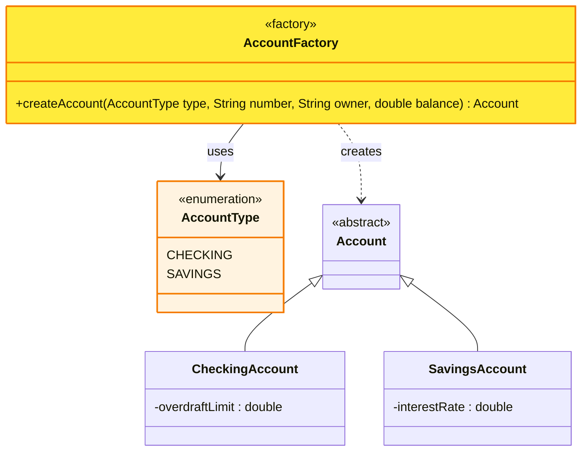

#### 2. Abstract Factory Pattern - Famiglie di Oggetti Correlati

L'Abstract Factory Pattern fornisce un'interfaccia per creare famiglie di oggetti correlati senza specificare le loro classi concrete. Nel sistema bancario, gestisce la differenziazione tra clienti standard e premium.

**Implementazione:** `BankFactory`, `StandardBankFactory`, `PremiumBankFactory`, `BankFactoryProvider`

**Problema Risolto:** Come creare famiglie coerenti di oggetti (account standard vs premium) mantenendo la flessibilità di cambiare l'intera famiglia senza modificare il codice client.

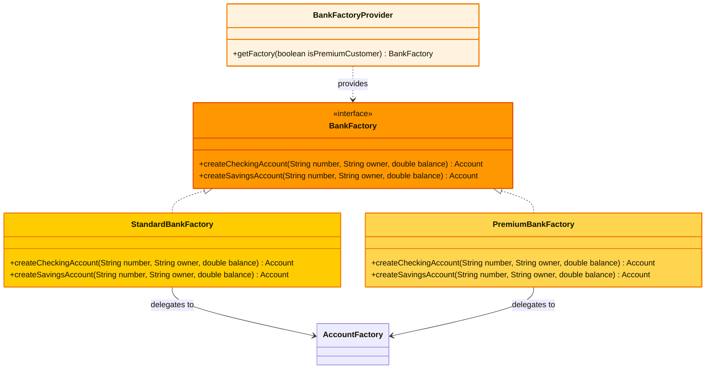

**Insight Progettuale:** Il pattern mantiene compatibilità totale con il sistema esistente delegando alla `AccountFactory` originale, dimostrando come i pattern possano essere introdotti incrementalmente in sistemi esistenti.

#### 3. Builder Pattern - Costruzione Flessibile di Oggetti Complessi

Il Builder Pattern separa la costruzione di un oggetto complesso dalla sua rappresentazione, permettendo allo stesso processo di costruzione di creare rappresentazioni diverse.

**Implementazione:** `AccountBuilder`

**Problema Risolto:** Come costruire account con molti parametri opzionali mantenendo un'interfaccia pulita e permettendo validazione incrementale durante la costruzione.

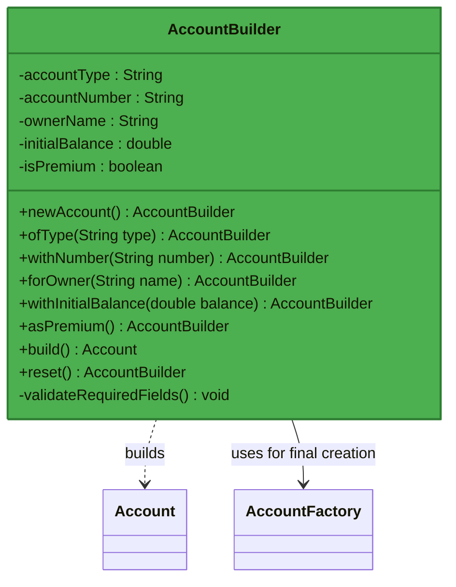

**Caratteristiche Avanzate:**

- Interfaccia fluida per leggibilità del codice
- Validazione incrementale con messaggi di errore specifici
- Metodo `reset()` per riutilizzo dello stesso builder
- Gestione di configurazioni premium attraverso il metodo `asPremium()`

#### 4. Singleton Pattern - Istanza Unica Globale

Il Singleton Pattern assicura che una classe abbia una sola istanza e fornisce un punto di accesso globale ad essa.

**Implementazione:** `BankConfiguration`

**Problema Risolto:** Come garantire che le configurazioni globali del sistema (nome sistema, versione, modalità debug) siano consistenti in tutto l'applicativo.

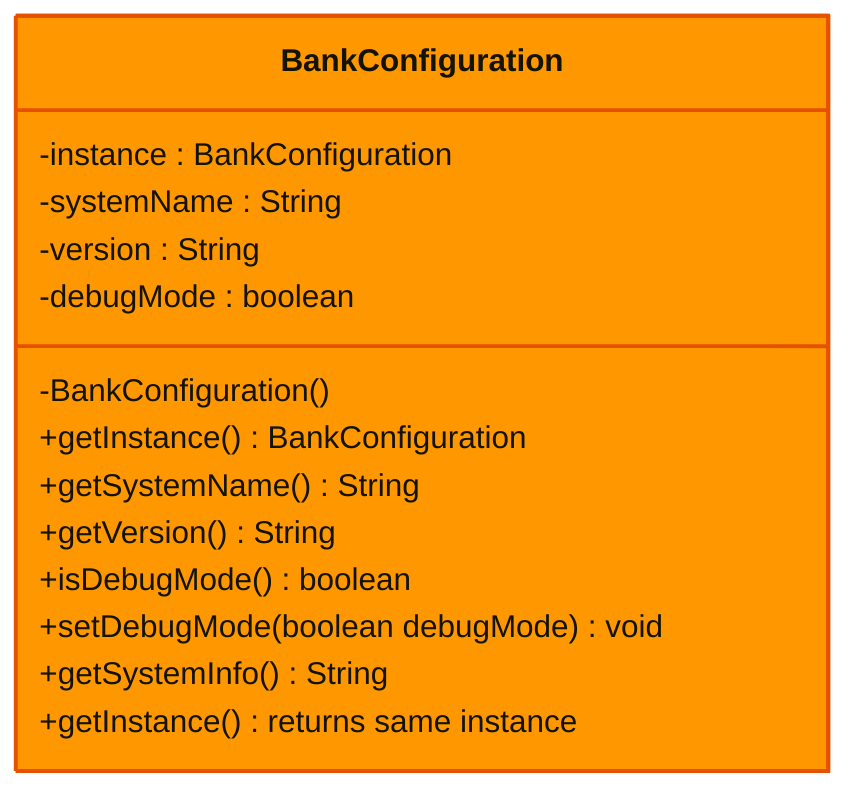

**Implementazione Thread-Safe:** Il metodo `getInstance()` è sincronizzato per prevenire race conditions in ambienti multi-threaded.

### Pattern Strutturali (Structural Patterns)

I pattern strutturali si occupano della composizione di classi e oggetti per formare strutture più grandi, mantenendo la flessibilità e l'efficienza.

#### 5. Composite Pattern - Strutture Gerarchiche Uniforme

Il Composite Pattern permette di comporre oggetti in strutture ad albero per rappresentare gerarchie parte-tutto. Permette ai client di trattare uniformemente oggetti singoli e composizioni di oggetti.

**Implementazione:** `AccountGroup`

**Problema Risolto:** Come gestire gruppi di account e sottogruppi in modo che le operazioni (calcolo saldi, conteggi) funzionino sia su singoli account che su interi gruppi.

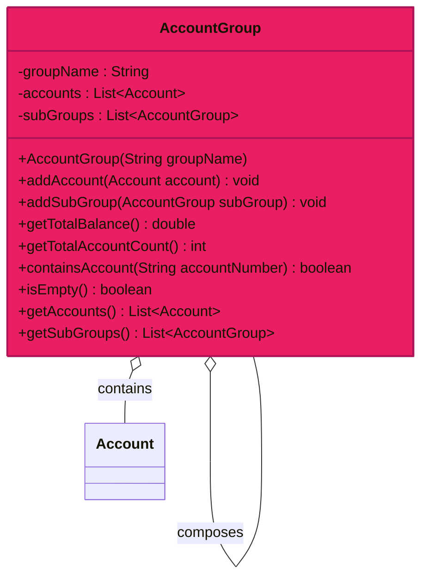

**Algoritmi Ricorsivi:** Le operazioni `getTotalBalance()` e `getTotalAccountCount()` utilizzano ricorsione per navigare l'intera gerarchia, dimostrando l'eleganza del pattern Composite.

#### 6. Bridge Pattern - Separazione Astrazione/Implementazione

Il Bridge Pattern separa un'astrazione dalla sua implementazione in modo che entrambe possano variare indipendentemente.

**Implementazione:** `OutputDevice`, `AccountDisplay`, `DetailedAccountDisplay`, `ConsoleOutputDevice`, `FileOutputDevice`

**Problema Risolto:** Come separare COSA visualizzare (informazioni account) da COME visualizzarlo (console, file, futuro: email, database) permettendo di variare entrambe le dimensioni indipendentemente.

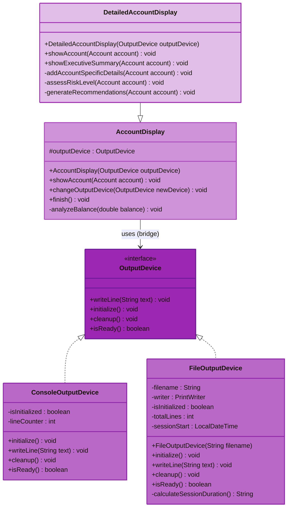

**Flessibilità Runtime:** Il metodo `changeOutputDevice()` permette di cambiare la modalità di output durante l'esecuzione, dimostrando la potenza del bridge pattern.

### Pattern Comportamentali (Behavioral Patterns)

I pattern comportamentali si concentrano sulla comunicazione tra oggetti e sull'assegnazione di responsabilità tra di essi.

#### 7. Strategy Pattern - Algoritmi Intercambiabili

Il Strategy Pattern definisce una famiglia di algoritmi, li incapsula e li rende intercambiabili. Permette all'algoritmo di variare indipendentemente dai client che lo utilizzano.

**Implementazione:** `WithdrawalStrategy`, `OverdraftWithdrawalStrategy`, `NoOverdraftWithdrawalStrategy`, `WithdrawalStrategyFactory`

**Problema Risolto:** Come gestire diverse politiche di prelievo (con/senza scoperto) senza duplicare codice e permettendo di aggiungere nuove politiche facilmente.

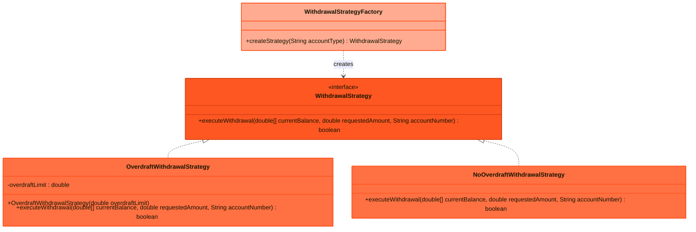

**Design Insight:** L'uso di `double[]` per il balance permette di modificare il valore per riferimento, simulando un parametro di input/output in Java.

#### 8. Observer Pattern - Notifica Automatica di Eventi

L'Observer Pattern definisce una dipendenza uno-a-molti tra oggetti in modo che quando un oggetto cambia stato, tutti i suoi dipendenti vengono notificati e aggiornati automaticamente.

**Implementazione:** `TransactionObserver`, `SimpleTransactionObserver`

**Problema Risolto:** Come monitorare automaticamente tutte le transazioni bancarie per logging, audit, e notifiche senza accoppiare il sistema di monitoraggio alla logica di business.

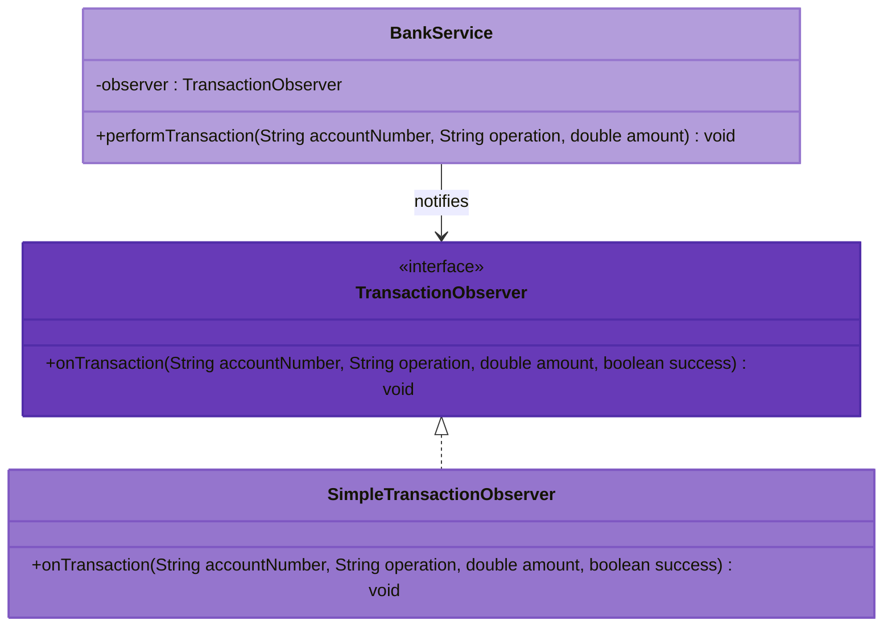

**Estensibilità:** Possono essere facilmente aggiunti nuovi observer (EmailNotificationObserver, SMSAlertObserver) senza modificare il BankService.

#### 9. Iterator Pattern - Navigazione Sicura delle Collezioni

L'Iterator Pattern fornisce un modo per accedere sequenzialmente agli elementi di un oggetto aggregato senza esporre la sua rappresentazione sottostante.

**Implementazione:** `AccountIterator`

**Problema Risolto:** Come navigare collezioni di account in modo sicuro, con possibilità di filtering, senza esporre la struttura interna delle collezioni.

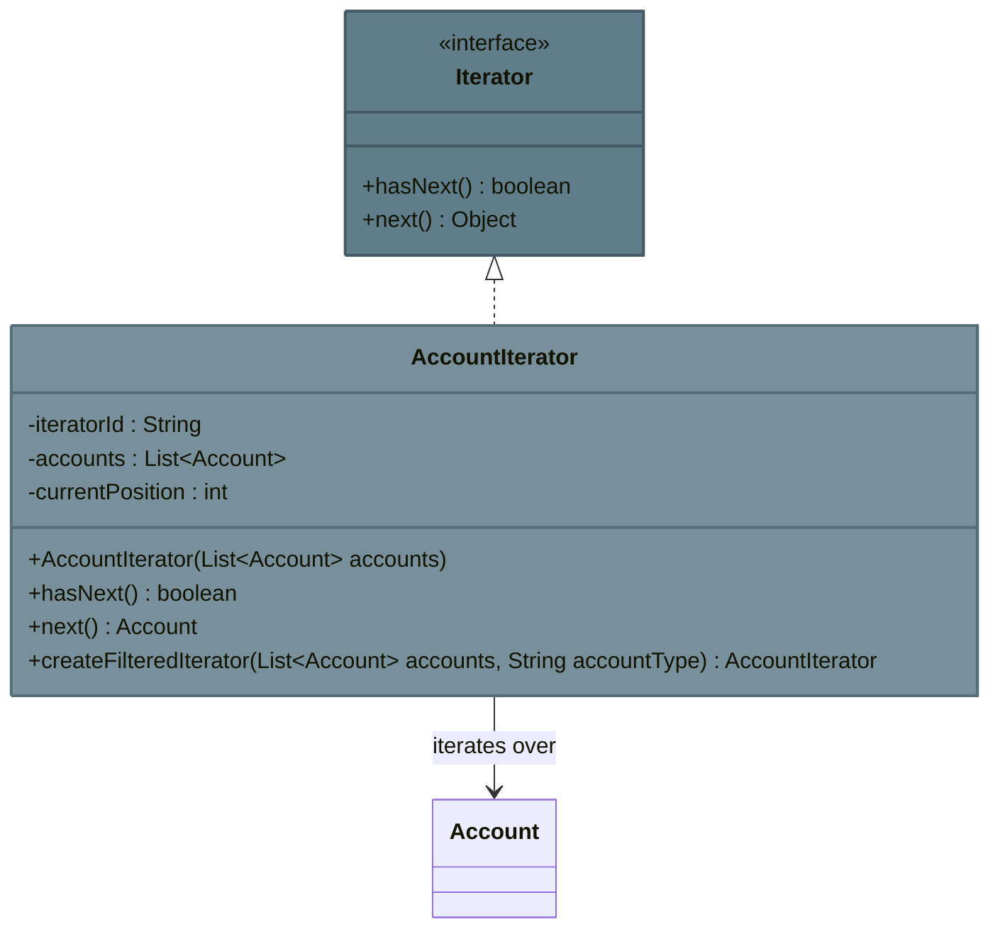

**Funzionalità Avanzate:** Il metodo statico `createFilteredIterator()` permette di creare iterator che mostrano solo account di un tipo specifico.

#### 10. Template Method Pattern - Struttura Algoritmica Fissa

Il Template Method Pattern definisce lo scheletro di un algoritmo in una operazione, rimandando alcuni passi alle sottoclassi. Permette alle sottoclassi di ridefinire certi passi di un algoritmo senza cambiarne la struttura.

**Implementazione:** `AccountReportGenerator`, `SimpleReportGenerator`, `DetailedReportGenerator`

**Problema Risolto:** Come standardizzare la struttura dei report bancari (header, contenuto, footer) permettendo personalizzazione dei dettagli specifici.

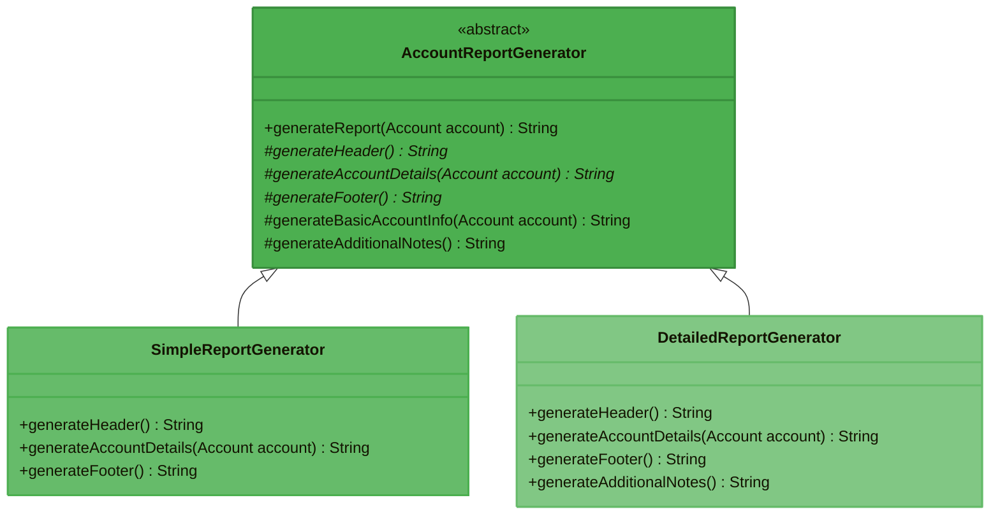

**Template Method in Action:** Il metodo `generateReport()` definisce la sequenza fissa: header → informazioni base → dettagli personalizzati → footer, mentre ogni sottoclasse personalizza i dettagli.

#### 11. Memento Pattern - Cattura e Ripristino di Stati

Il Memento Pattern cattura e esternalizza lo stato interno di un oggetto senza violare l'incapsulamento, permettendo di ripristinare l'oggetto a questo stato in seguito.

**Implementazione:** `AccountSnapshot`, `AccountBackup`

**Problema Risolto:** Come implementare funzionalità di backup e audit per account bancari, catturando stati in momenti specifici per analisi successive.

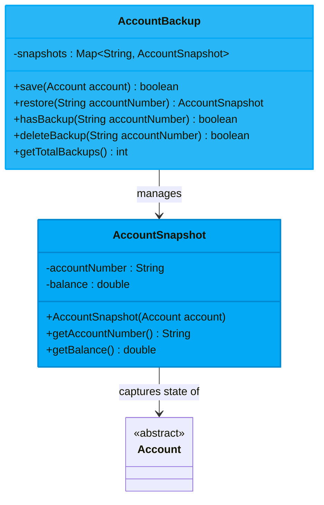

**Principio di Incapsulamento:** Il `AccountSnapshot` è immutabile e cattura solo lo stato essenziale, mentre `AccountBackup` funge da caretaker senza accedere ai dettagli interni.

### Pattern Architetturali

#### 12. Exception Shielding Pattern - Protezione delle Informazioni Sensibili

L'Exception Shielding Pattern separa le informazioni di errore destinate agli utenti finali da quelle destinate agli sviluppatori, proteggendo informazioni sensibili del sistema.

**Implementazione:** `BankException`

**Problema Risolto:** Come fornire messaggi di errore utili agli utenti finali senza esporre dettagli tecnici sensibili che potrebbero compromettere la sicurezza del sistema.

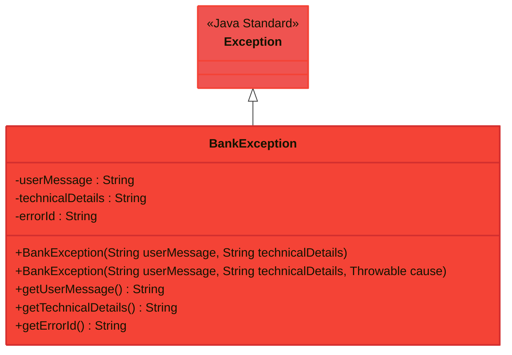

**Security by Design:** Ogni eccezione riceve un ID univoco per correlazione nei log, mentre l'utente vede solo messaggi sicuri e comprensibili.

## Comandi dell'Interfaccia Utente

Il sistema fornisce un'interfaccia a riga di comando completa e intuitiva:

### Comandi di Gestione Account

- `create <tipo> <numero> <nome> <saldo>` - Crea account standard
- `createpremium <tipo> <numero> <nome> <saldo>` - Crea account premium (Abstract Factory)
- `build <tipo> <numero> <nome> <saldo>` - Costruzione via Builder Pattern
- `balance <numero>` - Consultazione saldo con logging
- `list` - Visualizzazione completa degli account

### Comandi Transazionali

- `deposit <numero> <importo>` - Deposito con validazione
- `withdraw <numero> <importo>` - Prelievo con gestione scoperto
- Monitoraggio automatico via Observer Pattern
- Persistenza automatica delle modifiche

### Comandi di Sistema

- `demo` - Dimostrazione interattiva di tutti i 12 pattern
- `exit` - Chiusura sicura con cleanup risorse

Ogni comando include:

- Validazione automatica dell'input
- Messaggi di errore user-friendly via Exception Shielding
- Logging dettagliato per audit e debugging
- Feedback immediato sullo stato delle operazioni
